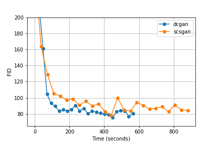

# SCSGAN
Generative Adversarial Network using Sharpened Cosine Similarity

This repo is a modified copy of PyTorch's [DCGAN (Deep Convolutional GAN) tutorial](https://github.com/pytorch/examples/tree/master/dcgan) but using [Sharpened Cosine Similarity](https://e2eml.school/scs.html) instead of convolutions.

The concept of SCS is inspired by [Brandon Rohrer](https://github.com/brohrer) ([Main SCS repo](https://github.com/brohrer/sharpened_cosine_similarity_torch)).

The implementation of SCS in this repo is taken from [Lucas Nestler](https://gist.github.com/ClashLuke) ([Gist](https://gist.github.com/ClashLuke/8f6521deef64789e76334f1b72a70d80)).

## Tests

Using the MNIST dataset

### FID + time

Currently SCS does not seem to be much better than deep conv GANs... More tinkering needed.

This is FID calculated on batches of 64 vs 64 images during training of 25 epochs.

### Original DGCAN (outdated)

Parameters in G: 3,574,656

Parameters in D: 2,763,520

https://user-images.githubusercontent.com/17656709/155170358-7ad5d423-1d06-4113-bc87-237706d96f05.mp4

### DC G + SCS D (outdated)

Parameters in G: 3,574,656

Parameters in D:   196,143

https://user-images.githubusercontent.com/17656709/155170384-74fce1d3-5b30-444c-92be-f57a97b713a1.mp4

### SCS G + SCS D (outdated)

Parameters in G: 2,046,987

Parameters in D:   196,143

https://user-images.githubusercontent.com/17656709/155170411-1cf19c5d-ed45-48e1-b9cf-d09761354f07.mp4

## TODO

- [x] Test new SCS implementation by Lucas Nestler

- [ ] Make p optional in SCS

- [X] Compare FID scores

- [X] Compare training time

- [x] Better SCS Generator without ReLU and normal conv

- [ ] Make SCS Generator better (find replacement for LeakyReLU?)

- [ ] Try more datasets

- [x] Update videos to use universally supported codec

- [ ] Update all videos to show new architectures
